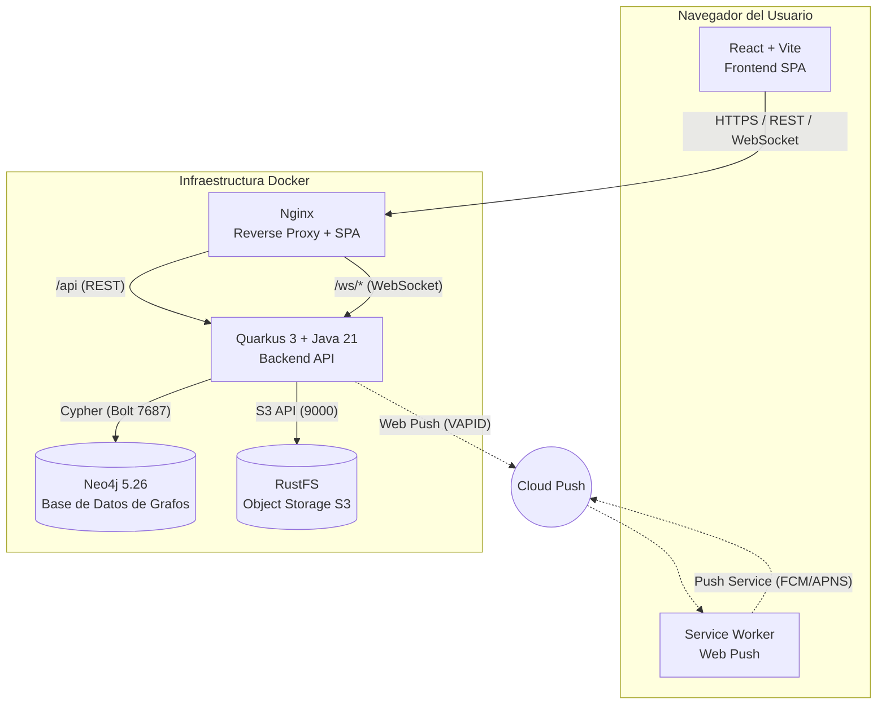

# Orbit — Red Social Distribuida

> **Proyecto académico — Sistemas Distribuidos y Cloud Computing**  
> Aplicación web distribuida que implementa las funcionalidades esenciales de una red social, integrando diferentes tecnologías y mecanismos de comunicación, persistencia y almacenamiento.

**🌐 Enlace de Producción:** [https://orbit.labtorres.me](https://orbit.labtorres.me)

---

## Integrantes

| Nombre | Rol |
|--------|-----|
| Damian Torres | Full Stack Developer / DevOps |
| Melanie Tomala | QA / QC |
| Jean Cedeño | Frontend Developer |

---

## Usuarios de Prueba

Para facilitar la evaluación, el sistema viene precargado con varios usuarios. **La contraseña de cada usuario es su propio nombre en minusculas seguido de `123`** (ejemplo: `jean123`, `damian123`, `melanie123`).


## Descripción del proyecto

**Orbit** es una red social distribuida construida como monolito modular en contenedores Docker. El backend (Quarkus + Java 21) expone una API REST y canales WebSocket, persiste el grafo social y los datos estructurados en **Neo4j**, almacena archivos multimedia en **RustFS (S3-compatible)**, y envía notificaciones **Web Push** mediante Service Workers.

La arquitectura demuestra el uso consciente de cada mecanismo propio de sistemas distribuidos:
- **REST** para operaciones CRUD y consultas
- **WebSocket** para comunicación bidireccional en tiempo real (chat, feed en vivo)
- **Web Push** para notificaciones fuera de la aplicación
- **Base de datos de grafos** para relaciones sociales nativas y recorridos
- **Object Storage** para archivos binarios
- **Contenedores** para despliegue reproducible

---

## Arquitectura

### Diagrama de alto nivel



### Flujo de datos principal

| Flujo | Protocolo | Descripción |
|-------|-----------|-------------|
| **Autenticación** | REST + Cookie HttpOnly | Login → JWT access token (memoria) + refresh token (cookie rotativa) |
| **Operaciones CRUD** | REST | Posts, perfiles, seguir, reacciones, feed histórico |
| **Chat tiempo real** | WebSocket | Tickets de un uso → `/ws/chat/{convId}` → persiste → difunde |
| **Feed en vivo** | WebSocket | `/ws/feed` → suscripción autorizada → difusión de cambios |
| **Notificaciones push** | Web Push (VAPID) | Publicación → cola `PushDelivery` en Neo4j → worker cada 10s → Service Worker |
| **Almacenamiento imágenes** | S3 API | Multipart → RustFS → `mediaKey` en Neo4j → URL firmada 60s para lectura |

### Modelo de datos (Neo4j)

```cypher
// Nodos principales
(:Usuario {id, username, email, passwordHash, bio, avatarUrl, createdAt, 
           profilePublic, avatarFollowersOnly, circleFollowersOnly, 
           followersFollowersOnly, bioFollowersOnly, messagesFollowersOnly, 
           interactionsFollowersOnly, instagram, reddit, discord})

(:Post {id, content, mediaKey, mediaType, mediaSize, createdAt})

(:Conversacion {id, createdAt})

(:Mensaje {id, text, sentAt, read})

(:PushSubscription {id, endpoint, p256dh, auth})

(:PushDelivery {id, postId, refId, type, url, payload, recipientId, 
                subscriptionId, status, attempts, nextAt})

// Relaciones
(:Usuario)-[:SIGUE]->(:Usuario)                    // Seguimiento dirigido (no recíproco)
(:Usuario)-[:PUBLICO]->(:Post)                     // Autoría de posts
(:Usuario)-[:LE_GUSTA]->(:Post)                    // Like/reacción
(:Usuario)-[:ENVIA]->(:Mensaje)-[:EN_CONVERSACION]->(:Conversacion)
(:Usuario)-[:PARTICIPA]->(:Conversacion)           // Participantes de conversación
(:Usuario)-[:HAS_SUBSCRIPTION]->(:PushSubscription) // Suscripciones Web Push por dispositivo
(:PushDelivery)-[:FOR_SUBSCRIPTION]->(:PushSubscription) // Cola de entregas push
```

Los nombres de relaciones `:SIGUE`, `:PUBLICO` y `:LE_GUSTA` son un diseño propio del grupo, tal como lo habilita la consigna («El grupo deberá diseñar y justificar su propio criterio»). `:PUBLICO` expresa la autoría de un post y `:LE_GUSTA` la reacción mínima registrada en el grafo, ambos con significado documentado en el código. Los ejemplos del enunciado (`:PUBLICA`, `:REACCIONA`) son conceptuales y no imponen una nomenclatura obligatoria.

---

## Stack tecnológico

| Componente | Tecnología | Versión | Justificación |
|------------|------------|---------|---------------|
| **Frontend** | React + Vite | 19 / 8 | SPA moderna, HMR rápido, ES modules nativos |
| **Routing** | React Router | 7 | Rutas declarativas, lazy loading |
| **Estilos** | CSS Modules + CSS Variables | — | Sin runtime, scoping nativo, theming |
| **Animaciones** | Framer Motion | — | Transiciones declarativas, layout animations |
| **Iconos** | lucide-react | — | Tree-shaking, SVG inline, consistencia |
| **Fechas** | date-fns | — | Modular, inmutable, i18n |
| **Visualización grafo** | Three.js + Vanta | — | WebGL para mapas de red interactivos |
| **Linting** | Oxlint | — | Rust-based, rápido, compatible ESLint |
| **Backend** | Quarkus | 3.x | Native/compiled, CDI, JAX-RS, startup rápido |
| **Lenguaje** | Java | 21 LTS | Records, pattern matching, virtual threads |
| **Build** | Maven | — | Gestión dependencias, profiles, wrapper |
| **Auth** | SmallRye JWT | — | MP-JWT spec, rotación refresh tokens |
| **DB Graph** | Neo4j | 5.26 | Grafo nativo, Cypher, ACID, Bolt protocol |
| **Driver** | Neo4j Java Driver | 5.x | Reactive/imperativo, connection pooling |
| **Object Storage** | RustFS | Latest | S3-compatible, Rust, alto rendimiento |
| **SDK S3** | AWS SDK v2 | 2.x | Async, non-blocking, región configurable |
| **WebSocket** | Quarkus WebSockets Next | — | JSR-356, subprotocols, CDI integration |
| **Web Push** | nl.martijndwars/webpush | — | RFC 8030, VAPID, BouncyCastle crypto |
| **Service Worker** | Workbox (custom) | — | Cache, push events, offline support |
| **Proxy/SPA** | Nginx | Alpine | Reverse proxy, gzip, rate limiting, SPA fallback |
| **Contenedores** | Docker Compose | v2 | Orquestación local/prod, healthchecks, volumes |

---

## Instrucciones de ejecución

### Prerrequisitos

- Docker Compose v2
- Git Bash / WSL (Windows) o terminal Unix
- OpenSSL (para generar claves JWT)
- Node.js 20+ y npm (solo para desarrollo fuera de Docker)

### Variables de entorno

Copiar la plantilla y completar valores reales:

```bash
cp .env.example .env
```

Variables obligatorias en `.env`:

```bash
# Neo4j
NEO4J_USER=neo4j
NEO4J_PASSWORD=changeme          # Cambiar en producción

# RustFS / S3
RUSTFS_ACCESS_KEY=minioadmin     # Cambiar en producción
RUSTFS_SECRET_KEY=minioadmin     # Cambiar en producción
RUSTFS_BUCKET=red-social
RUSTFS_PUBLIC_ENDPOINT=http://localhost:9000

# WebSocket
WEBSOCKET_ALLOWED_ORIGIN=http://localhost:3000

# JWT (se generan con scripts/generate-jwt-keys.sh)
SMALLRYE_JWT_SIGN_KEY_LOCATION=./secrets/privateKey.pem
MP_JWT_VERIFY_PUBLICKEY_LOCATION=./secrets/publicKey.pem
JWT_SECRET=                      # Se genera automáticamente

# Web Push VAPID (se generan con node scripts/generate-vapid-keys.mjs)
VAPID_PUBLIC_KEY=
VAPID_PRIVATE_KEY=
VAPID_SUBJECT=mailto:admin@redsocial.dev

# Puertos
BACKEND_PORT=8080
FRONTEND_URL=http://localhost:3000
```

### Generar secretos criptográficos

```bash
# Claves JWT (RSA 2048)
sh scripts/generate-jwt-keys.sh

# Claves VAPID para Web Push
node scripts/generate-vapid-keys.mjs
```

> **ADVERTENCIA:** No incluir en el control de versiones el archivo `.env`, el directorio `secrets/`, ni las claves privadas. Estos deben permanecer en el `.gitignore`.

### Levantar entorno de desarrollo

```bash
docker compose up --build
```

Servicios disponibles:

| Servicio | URL | Descripción |
|----------|-----|-------------|
| Aplicación | http://localhost:3000 | Frontend React servido por Nginx |
| API / Swagger | http://localhost:8080 / http://localhost:8080/q/swagger-ui | Backend Quarkus + OpenAPI |
| Neo4j Browser | http://localhost:7474 | Consola de base de datos grafo |
| RustFS Console | http://localhost:9001 | Consola de object storage |

### Comandos de desarrollo

```bash
# Backend
cd backend
mvn -B clean test           # Tests unitarios
mvn -B -DskipTests package  # Build JAR

# Frontend
cd frontend
npm run dev                 # Dev server con HMR (puerto 5173)
npm run build               # Build producción (dist/)
npm run lint                # Oxlint
npm run test:graph          # Tests utilidades grafo
npm run test:push           # Tests utilidades push

# Verificación completa (smoke tests)
cd ..
./scripts/phase-a-c-smoke.ps1   # Auth, usuarios, grafo social
./scripts/phase-d-smoke.ps1     # Posts, imágenes, S3
./scripts/phase-e-smoke.ps1     # Feed, reacciones, notificaciones internas
./scripts/phase-f-g-smoke.ps1   # Grafo: consultas Cypher, recomendaciones
# WebSocket chat se verifica en phase-e
# Web Push se verifica en phase-f-g (cola + suscripciones)
```

### Despliegue en producción

```bash
# Usar compose autónomo (no combinar con dev)
docker compose -f docker-compose.prod.yml up --build -d
```

---

## Endpoints principales (API REST)

### Autenticación
```
POST   /api/auth/register           # Registro (username, email, password)
POST   /api/auth/login              # Login (identifier: username|email, password)
POST   /api/auth/refresh            # Rotar access + refresh token (cookie)
POST   /api/auth/logout             # Revocar refresh token + limpiar cookie
```

### Usuarios y Perfil
```
GET    /api/users/me                # Perfil del usuario autenticado
PATCH  /api/users/me                # Actualizar perfil (bio, avatar, privacidad, redes)
GET    /api/users/{id}              # Perfil público de otro usuario
GET    /api/users/{id}/followers    # Seguidores paginados
GET    /api/users/{id}/following    # Seguidos paginados
POST   /api/users/{id}/follow       # Seguir usuario
DELETE /api/users/{id}/follow       # Dejar de seguir
GET    /api/users/{id}/suggestions  # Recomendaciones basadas en grafo
GET    /api/users/search?q=...      # Búsqueda por username
```

### Publicaciones
```
POST   /api/posts                   # Crear post solo texto
POST   /api/posts/with-image        # Crear post con imagen (multipart)
GET    /api/posts/{id}              # Detalle de post
GET    /api/posts/{id}/media-url    # URL firmada 60s para imagen
DELETE /api/posts/{id}              # Borrar post (agenda limpieza S3)
POST   /api/posts/{id}/like         # Like / unlike (toggle)
GET    /api/posts/{id}/likes        # Usuarios que dieron like
POST   /api/posts/{id}/comments     # Comentar
GET    /api/posts/{id}/comments     # Comentarios paginados
```

### Feed
```
GET    /api/feed                    # Feed de seguidos (paginado)
GET    /api/feed/explore            # Feed de exploración (paginado)
POST   /api/feed/ws-ticket          # Ticket WebSocket para feed en vivo (sin body)
```

### Mensajería (Chat)
```
GET    /api/messages/conversations  # Lista de conversaciones (interlocutores)
GET    /api/messages/{userId}       # Historial paginado con un usuario
POST   /api/messages/ws-ticket      # Ticket WebSocket para chat ({otherUserId})
GET    /api/messages/{userId}/read  # Marcar como leídos
```

### Notificaciones internas (Campana)
```
GET    /api/notifications           # Lista de notificaciones
GET    /api/notifications/unread    # Contador de no leídas
POST   /api/notifications/read-all  # Marcar todas como leídas
```

### Web Push
```
GET    /api/push/public-key         # Clave pública VAPID
POST   /api/push/subscriptions      # Registrar suscripción (desde Service Worker)
DELETE /api/push/subscriptions      # Eliminar suscripción
```

### Grafo Social (Vista Red)
```
GET    /api/graph/common/{otherId}      # Seguidos en común (Q1)
GET    /api/graph/reachable             # Alcance 1-2 pasos (Q2)
GET    /api/graph/recommendations       # Recomendaciones explicables (Q3)
GET    /api/graph/network-posts         # Posts de la red (Q4 - feed grafo)
GET    /api/graph/trending-posts        # Posts destacados por likes (Q5)
```

---

## WebSocket — Detalle técnico

### Chat (`/ws/chat/{conversationId}`)

| Aspecto | Implementación |
|---------|----------------|
| **Autenticación** | Ticket de un uso (30s) vía `POST /api/messages/ws-ticket` con `{otherUserId}` |
| **Subprotocolo** | Ticket enviado en `Sec-WebSocket-Protocol` (NO en URL) |
| **Origen** | Validado contra `WEBSOCKET_ALLOWED_ORIGIN` |
| **Formato mensaje** | `{ "clientMessageId": "UUID", "text": "..." }` (máx 1000 chars, frame 2048 bytes) |
| **Rate limit** | 10 mensajes / 10 segundos por conexión |
| **Persistencia** | Guarda en Neo4j **antes** de difundir (at-least-once) |
| **Deduplicación** | Por `clientMessageId` en reintentos |
| **Reconexión** | Historial REST + merge por ID sin duplicados |
| **Presencia** | `PresenceContext` + heartbeat; estado online/offline en Neo4j |

### Feed en vivo (`/ws/feed`)

| Aspecto | Implementación |
|---------|----------------|
| **Autenticación** | Ticket vía `POST /api/feed/ws-ticket` (sin body) |
| **Suscripción** | Usuario recibe eventos de posts/likes/comentarios de sus seguidos |
| **Eventos** | `POST_CREATED`, `POST_LIKED`, `POST_COMMENTED`, `POST_DELETED` |
| **Entrega** | Solo a suscriptores autorizados (verifica `SIGUE` al difundir) |

---

## Web Push — Detalle técnico

### Flujo completo

```
1. Usuario activa push en Configuración → Permiso navegador → Suscripción Push
2. Suscripción (endpoint, p256dh, auth) → POST /api/push/subscriptions → Neo4j
3. Usuario seguido publica → PostService → PushNotificationService.onPostCreated()
4. Consulta seguidores con suscripción activa (Cypher DISTINCT)
5. Crea nodos PushDelivery en Neo4j (misma transacción que el post)
6. PushDeliveryWorker (cada 10s) → procesa PENDING → WebPushSender.send()
7. Service Worker (/sw.js) recibe push → muestra notificación con payload {type, refId, url}
8. Click en notificación → abre /posts/{refId} o fallback a home
```

### Garantías y reintentos

- **Cola durable**: `PushDelivery` persiste en Neo4j; sobrevive a reinicios del backend
- **At-least-once**: Worker reintenta hasta 5 veces con backoff exponencial
- **Validación previa al envío**: Verifica `SIGUE` vigente, suscripción válida, post existe
- **No bloquea publicación**: Error push no revierte el post (fire-and-forget desde API)
- **Limpieza**: Al desactivar push o logout, elimina suscripción del servidor y navegador
- **Endpoint revocado**: 404/410 del servicio push → elimina suscripción local

### Service Worker (`public/sw.js`)

- Registrado en root (`scope: '/'`)
- Maneja `push` event → `self.registration.showNotification()`
- Maneja `notificationclick` → `clients.openWindow(url)`
- Payload mínimo: `{ "type": "POST_CREATED", "refId": "post-id", "url": "/posts/post-id" }`

---

## Consultas Cypher implementadas (5 no triviales)

Todas en `backend/src/main/java/com/redsocial/graph/GraphRepository.java`. Parten del `userId` del JWT.

### Q1 — Seguidos en común
```cypher
MATCH (:Usuario {id: $userId})-[:SIGUE]->(common:Usuario)<-[:SIGUE]-(:Usuario {id: $otherId})
RETURN DISTINCT common.id, common.username
ORDER BY username, id LIMIT 50
```
> Compara salidas de seguimiento de dos usuarios. Base para "amigos en común".

### Q2 — Alcance hasta dos pasos (MULTI-NIVEL)
```cypher
MATCH path=(me:Usuario {id: $userId})-[:SIGUE*1..2]->(target:Usuario)
WHERE target <> me AND all(n IN nodes(path) WHERE single(x IN nodes(path) WHERE x = n))
WITH target, path ORDER BY length(path), [n IN nodes(path) | n.id]
WITH target, head(collect(path)) AS path
RETURN target.id, target.username, length(path) AS distance, nodes(path)[1].id AS viaId
ORDER BY distance, username, id LIMIT 100
```
> **Recorre relaciones de profundidad variable (`*1..2`)**. Encuentra usuarios alcanzables en 1 o 2 saltos, excluye ciclos, elige camino más corto determinista. `viaId` permite dibujar la arista real del segundo salto.

### Q3 — Recomendaciones explicables
```cypher
MATCH (me:Usuario {id: $userId})-[:SIGUE]->(via:Usuario)-[:SIGUE]->(candidate:Usuario)
WHERE candidate <> me AND NOT (me)-[:SIGUE]->(candidate)
WITH candidate, via ORDER BY via.username
WITH candidate, collect(DISTINCT via.username) AS mutuals, count(DISTINCT via) AS mutualCount
RETURN candidate.id, candidate.username, mutualCount, mutuals
ORDER BY mutualCount DESC, username, id LIMIT 50
```
> Recomienda seguidos de seguidos ("amigos de mis amigos"), indica conexiones comunes (`mutuals`), excluye a quien ya sigo. Orden determinista por `mutualCount`.

### Q4 — Publicaciones de la red (Feed grafo)
```cypher
MATCH (:Usuario {id: $userId})-[:SIGUE]->(author:Usuario)-[:PUBLICO]->(p:Post)
OPTIONAL MATCH (liker:Usuario)-[:LE_GUSTA]->(p)
WITH author, p, count(DISTINCT liker) AS likeCount
RETURN p.id, author.id, author.username, p.content, p.createdAt, likeCount
ORDER BY createdAt DESC, id LIMIT 50
```
> Recorrido `SIGUE` + `PUBLICO` — solo posts de autores que sigo. Conteo opcional de likes sin duplicar filas.

### Q5 — Publicaciones destacadas por reacciones (Trending)
```cypher
MATCH (:Usuario {id: $userId})-[:SIGUE]->(author:Usuario)-[:PUBLICO]->(p:Post)
OPTIONAL MATCH (liker:Usuario)-[:LE_GUSTA]->(p)
WITH author, p, count(DISTINCT liker) AS likeCount
RETURN p.id, author.id, author.username, p.content, p.createdAt, likeCount
ORDER BY likeCount DESC, createdAt DESC, id LIMIT 50
```
> Mismo patrón que Q4 pero ordenado por `likeCount DESC`. Posts sin likes quedan con conteo 0.

### Fixture reproducible (smoke test)

`scripts/phase-f-g-smoke.ps1` crea usuarios A,B,C,D,E con aristas:
```
A→B, A→C, B→C, B→D, C→D
Posts: B(2), C(1), E(1) — E no es seguido por A
```

Resultados esperados:
| Consulta | Resultado clave |
|----------|-----------------|
| Q1(A,B)  | C |
| Q1(A,E)  | ∅ |
| Q2(A)    | B,C (dist=1), D (dist=2 via B/C), nunca E |
| Q3(A)    | D (2 conexiones: B y C) |
| Q4(A)    | 3 posts de B/C, 0 de E |
| Q5(A)    | Post de B con 2 likes primero; 3 IDs únicos |

---

## Seguridad y autenticación

### Estrategia de tokens (JWT + Refresh Rotation)

| Token | TTL | Almacenamiento | Uso |
|-------|-----|----------------|-----|
| **Access Token** | 15 min | **Solo memoria** (React state) | Authorization: Bearer en requests |
| **Refresh Token** | 30 días | Cookie `HttpOnly; Secure; SameSite=Strict; Path=/api/auth/refresh` | Rotación en `/api/auth/refresh` |

- **Rotación**: Cada refresh revoca el token usado y emite par nuevo (access + refresh)
- **Logout**: Revoca refresh token en Neo4j + limpia cookie
- **Interceptador 401**: Frontend detecta 401 → llama refresh automáticamente → reintenta request original (una vez)
- **Sin localStorage**: Access token nunca persiste en disco

### Validaciones backend

- Bean Validation (`@NotBlank`, `@Size`, `@Email`, `@Pattern`) en DTOs
- `CurrentUser` extrae `sub` del JWT verificado (no confía en cliente)
- Verificación de propiedad antes de mutaciones (post, conversación, suscripción)
- Rate limiting en WebSocket (10 msg/10s)
- `POST /api/auth/login` está limitado por identificador de cuenta normalizado (ventana fija, 10 fallos en 15 min por defecto) para evitar que una cabecera `X-Forwarded-For` falsificada eluda el límite; configurable vía `APP_AUTH_LOGIN_MAX_ATTEMPTS` y `APP_AUTH_LOGIN_WINDOW_SECONDS`. El contador reside en memoria de cada instancia y un tercero puede provocar un bloqueo temporal de un identificador conocido.
- Validación de archivos: PNG/JPEG reales, ≤5 MiB, ≤16 MP, extension≡MIME

### Web Push — Validación de endpoints

- Solo acepta endpoints HTTPS de servicios push conocidos (FCM, APNS, Mozilla, etc.)
- Rechaza endpoints `http://localhost`, `http://127.0.0.1`, IPs privadas → previene SSRF

---

## Dockerización

### `docker-compose.yml` (Desarrollo)

```yaml
services:
  neo4j:           # Graph DB + APOC
  rustfs:          # S3-compatible object storage
  rustfs-init:     # Crea bucket + políticas (solo avatars públicos; posts privados)
  backend:         # Quarkus JVM build (Dockerfile.jvm)
  frontend:        # Nginx + React build (multi-stage Dockerfile)
```

**Características:**
- Healthchecks en todos los servicios (Neo4j: `cypher-shell`, RustFS: `/health`, Backend: `/q/health`)
- Dependencias ordenadas: `backend` espera `neo4j:healthy` + `rustfs-init:completed`
- Volúmenes persistentes: `neo4j_data`, `neo4j_logs`, `rustfs_data`
- Secrets JWT en bind mount read-only: `./secrets:/deployments/config:ro`
- Variables via `.env` (Compose resuelve `${...}` al parsear)

### `docker-compose.prod.yml` (Producción)

- Mismos servicios, configuración endurecida
- Puertos internos solo en `127.0.0.1` (3000, 8080, 9000)
- Cloudflare Tunnel publica HTTPS → servicios internos
- Neo4j y RustFS console **no expuestos**
- Volúmenes nombrados para backups

---

## Testing y verificación

### Tests unitarios backend (9 PASS)
```bash
cd backend && mvn -B clean test
```
Cobertura: Auth (registro, login, refresh, logout), Seed, Feed, Presencia, Notificaciones, Usuarios.

### Lint + Build frontend
```bash
cd frontend && npm run lint && npm run build
```

### Smoke tests automatizados (PowerShell)

| Script | Qué verifica |
|--------|--------------|
| `phase-a-c-smoke.ps1` | Auth, usuarios, grafo social (seguir, sugerencias) |
| `phase-d-smoke.ps1` | Posts, imágenes, S3 (subida, URL firmada, limpieza) |
| `phase-e-smoke.ps1` | Feed, reacciones, notificaciones internas, WebSocket chat |
| `phase-f-g-smoke.ps1` | **5 consultas Cypher** con fixture reproducible |
| `phase-d-outage-smoke.ps1` | Caída de RustFS → 503 sin post huérfano → recuperación |

> Los smokes usan usuarios temporales con nombres únicos y limpian solo sus datos.

---

## Estructura del repositorio

```
red-social/
├── backend/
│   ├── src/main/java/com/redsocial/
│   │   ├── auth/           # AuthResource, TokenService, RefreshTokenRepository
│   │   ├── user/           # UserResource, UserService, UserRepository, User.java (record)
│   │   ├── post/           # PostResource, PostService, PostRepository, MediaCleanupService
│   │   ├── feed/           # FeedResource, FeedService, FeedRepository, FeedDelivery (WS)
│   │   ├── messaging/      # MessageResource, MessageService, MessageRepository, ChatSocket
│   │   ├── notification/   # NotificationResource, InAppNotificationService
│   │   ├── graph/          # GraphResource, GraphRepository (5 consultas Cypher)
│   │   ├── notification/   # PushNotificationService, WebPushSender, PushDeliveryWorker
│   │   ├── common/         # CurrentUser, GlobalExceptionMapper, ErrorResponse
│   │   └── config/         # SchemaInitializer, DemoDataSeeder
│   ├── src/main/resources/
│   │   └── application.properties
│   └── src/main/docker/Dockerfile.jvm
├── frontend/
│   ├── src/
│   │   ├── pages/          # Login, Register, Feed, PostDetail, Profile, Settings, Graph, Chat
│   │   ├── components/     # feed/, layout/, presence/, shared/
│   │   ├── context/        # AuthContext, PresenceContext, FeedEventsContext
│   │   ├── lib/            # api.js, chatSocket.js, feedSocket.js, push.js, notifications.js
│   │   ├── App.jsx         # Rutas + DashboardLayout
│   │   └── main.jsx        # Entry point
│   ├── public/sw.js        # Service Worker Web Push
│   ├── Dockerfile          # Multi-stage: build → nginx
│   └── nginx.conf          # Proxy /api, /ws + SPA fallback
├── scripts/                # Generadores claves, smoke tests, utilidades
├── docs/
│   ├── ARCHITECTURE.md     # Este documento (arquitectura detallada)
│   └── CYPHER_QUERIES.md   # 5 consultas + fixture + semántica
├── docker-compose.yml
├── docker-compose.prod.yml
├── .env.example
├── .env.prod.example
└── README.md               # Este archivo
```

---

## Decisiones técnicas relevantes

| Decisión | Alternativa | Justificación |
|----------|-------------|---------------|
| **Neo4j vs PostgreSQL** | Relacional con JOINs recursivos / CTE | Grafo nativo: `SIGUE` dirigido, recorridos variables (`*1..2`), recomendaciones por caminos, no joins. Cypher expresa intención directamente. |
| **WebSocket vs Polling** | Long polling / Server-Sent Events | Chat requiere bidireccionalidad real, baja latencia, servidor empuja. Tickets de un uso en subprotocolo = seguro. |
| **Web Push vs Notificaciones in-app** | Solo toast/polling en React | Web Push funciona con pestaña cerrada, Service Worker independiente del ciclo de vida de la SPA. |
| **RustFS vs MinIO vs S3 real** | MinIO / AWS S3 | RustFS: Rust, alto rendimiento, S3-compatible, single binary, licencia Apache 2.0. |
| **Monolito modular vs Microservicios** | Separar auth, posts, chat, notificaciones | Equipo pequeño, dominio cohesionado, una sola BD grafo, transacciones ACID cross-domain (post + push delivery), menor complejidad operativa. |
| **Access token en memoria** | localStorage / IndexedDB | Mitiga XSS: token no accesible desde JS malicioso. Refresh en cookie HttpOnly mitiga CSRF (SameSite=Strict). |
| **Rotación refresh token** | Refresh token estático | Compromiso de refresh token → ventana de 30 días. Rotación limita exposición y permite detección de robo (token revocado = alerta). |
| **Cola PushDelivery en Neo4j** | Cola en memoria / Redis / Kafka | Durabilidad sin dependencia extra. Neo4j ya está. Transacción atómica: post + entregas. Worker simple cada 10s. |
| **Tickets WebSocket de un uso** | JWT en query param / header | Token no en URL (logs, history). Corta vida (30s). Vinculado a par de usuarios + expiración JWT. Subprotocolo = estándar. |
| **MediaKey generada por servidor** | Cliente envía URL / nombre archivo | Previene path traversal, colisiones, enumeración. Clave aleatoria + validación MIME/extensión/tamaño servidor. |
| **Limpieza compensatoria S3** | Transacción distribuida / Saga | Si falla post tras subir imagen → intenta borrar S3; si falla → agenda en Neo4j → reintenta al inicio. Eventual consistency sin orquestador externo. |
| **Privacidad granular por campo** | Binario público/privado | Usuario controla qué ve quién: perfil, avatar, círculo, seguidores, bio, mensajes, interacciones. Cada campo con flag booleano. |

---

## Evidencias obligatorias (checklist de demostración)

- [x] **1. Registro e inicio de sesión** — `POST /api/auth/register`, `POST /api/auth/login`
- [x] **2. Dos o más usuarios interactuando** — Usuarios A y B creados, logueados en pestañas distintas
- [x] **3. Seguimiento entre usuarios** — A sigue a B → `POST /api/users/{id}/follow` → aparece en seguidores/seguidos
- [x] **4. Visualización del grafo generado** — Pestaña `/graph` → mapa interactivo (Three.js) + pestañas Descubrir/Mapa/En común
- [x] **5. Creación de publicaciones** — Post texto + post con imagen → `POST /api/posts/with-image`
- [x] **6. Carga de archivo a S3** — Imagen subida → RustFS Console muestra objeto en bucket `red-social/posts/`
- [x] **7. Feed personalizado** — `/feed` muestra solo posts de seguidos (no de todos)
- [x] **8. Consulta de recomendación basada en grafo** — `/graph` → pestaña "Para ti" → recomendaciones con conexiones comunes
- [x] **9. Chat tiempo real entre dos clientes** — A y B abren chat → mensajes instantáneos sin recargar
- [x] **10. Recepción notificación Web Push** — A publica → B (con push activado) recibe notificación nativa → click abre post
- [x] **11. Ejecución consultas Cypher** — Neo4j Browser: `CALL db.schema.visualization()`, correr Q1–Q5
- [x] **12. Levantamiento infraestructura contenedores** — `docker compose up --build` → todos healthy

---

## Documentación adicional

- [`docs/ARCHITECTURE.md`](docs/ARCHITECTURE.md) — Arquitectura detallada, patrones, flujos, modelo de datos
- [`docs/CYPHER_QUERIES.md`](docs/CYPHER_QUERIES.md) — 5 consultas Cypher con semántica, fixture y resultados esperados

---

## Licencia

Proyecto académico — Uso educativo.

---

> **Condición fundamental**: El proyecto no se evalúa únicamente por funcionar. El grupo debe demostrar que comprende **qué componente se comunica con cuál, mediante qué mecanismo, dónde se almacena cada tipo de información y por qué se tomó cada decisión tecnológica**. La finalidad es experimentar en la práctica diferentes conceptos de **Sistemas Distribuidos**.
