# Guía de arquitectura de Orbit

Resumen del estado del repositorio al 29-09-2026. Este documento describe el diseño observado en el código; `README.md` sigue siendo la guía de arranque y operación.

## Visión general

Orbit es un monolito distribuido en servicios Docker, con el backend organizado por módulos de negocio. El navegador React usa HTTP REST para operaciones y consultas; el chat y las actualizaciones en vivo del feed usan WebSockets. Quarkus guarda nodos, relaciones y trabajos durables en Neo4j mediante Cypher. Los binarios de medios viven en RustFS compatible con S3. El navegador recibe notificaciones Web Push desde el backend.

```mermaid
architecture-beta
    group browser(cloud)[Navegador del Usuario]
    group infra(cloud)[Infraestructura Docker]

    service react(component)[React + Vite\nFrontend SPA] in browser
    service sw(component)[Service Worker\nWeb Push] in browser

    service nginx(component)[Nginx\nReverse Proxy + SPA] in infra
    service quarkus(component)[Quarkus 3 + Java 21\nBackend API] in infra
    service neo4j(database)[Neo4j 5.26\nBase de Datos de Grafos] in infra
    service rustfs(database)[RustFS\nObject Storage S3] in infra

    react --> nginx: HTTPS/REST/WebSocket
    sw --> rustfs: Push Service (FCM/APNS/etc)
    
    nginx --> quarkus: /api (REST)
    nginx --> quarkus: /ws/chat, /ws/feed (WebSocket)
    
    quarkus --> neo4j: Cypher (Bolt 7687)
    quarkus --> rustfs: S3 API (9000)
    
    quarkus -.-> sw: Web Push (VAPID)
```



La relación social es dirigida: `(:Usuario)-[:SIGUE]->(:Usuario)`. Seguir no implica amistad ni seguimiento recíproco. La app se despliega como frontend, backend, Neo4j y RustFS; no es una arquitectura de microservicios por dominio.

## Stack

| Capa | Tecnología y responsabilidad |
|---|---|
| Frontend | React 19, React Router 7, Vite 8, JavaScript ES modules, CSS por página/componente; Framer Motion para transiciones, lucide-react para iconos, date-fns para fechas y Three/Vanta en fondos visuales. Oxlint verifica estilo/código. |
| Backend | Java 21 y Quarkus 3 (Maven); Jakarta REST/JAX-RS, CDI, Bean Validation, SmallRye JWT, WebSockets Next, OpenAPI/Swagger y cliente oficial Neo4j. |
| Persistencia | Neo4j 5.26 y Cypher; S3 compatible mediante AWS SDK v2, servido por RustFS. |
| Entrega | Docker Compose, imagen Java JVM, Nginx para frontend y proxy `/api` + `/ws`; service worker para Web Push. |

No hay ORM relacional: los repositorios construyen consultas Cypher parametrizadas. No hay Redux; el estado de sesión, presencia y eventos del feed vive en React Context y el resto en el estado local de cada pantalla.

## Organización del código

### Backend (`backend/src/main/java/com/redsocial`)

- `auth`: registro, login, refresh/logout rotativo, entidad y repositorio de refresh tokens.
- `user`: modelo/proyección de usuario, perfil, ajustes, búsquedas y operaciones del grafo social.
- `post`: publicaciones/comentarios, validación y almacenamiento de imágenes, limpieza compensatoria.
- `feed`: consultas de feed, entrega en vivo, tickets WebSocket.
- `messaging`: mensajes, presencia, scheduler y tickets/canal de chat.
- `notification`: bandeja interna y colas/entrega Web Push.
- `graph`: consultas de red/recomendación.
- `common`: usuario derivado del JWT, errores y mapper global.
- `config`: inicialización de esquema y datos de demostración.
- `src/main/resources/application.properties`: configuración Quarkus por perfil y variables externas.
- `src/test/java`: pruebas unitarias/recursos, con cobertura de auth, seed, feed, presencia, notificaciones y usuarios.

Cada módulo suele separar `*Resource` (HTTP/adaptador de entrada), `*Repository` (Cypher/persistencia), modelo y servicios auxiliares. Los records DTO acotan cargas API. No es Clean Architecture estricta: recursos y servicios llaman directamente repositorios/CDI y no hay capas de casos de uso o puertos/adaptadores formales.

### Frontend (`frontend/src`)

- `pages`: vistas de auth, feed, detalle, grafo, chat, perfil y ajustes.
- `components`: piezas compartidas agrupadas por `feed`, `layout`, `presence` y `shared`.
- `context`: auth, presencia y eventos de feed.
- `lib/api.js`: cliente fetch autenticado, refresh/reintento 401, multipart y fachadas de endpoints.
- `lib/*Socket.js`, `notifications.js`, `push.js`: canales en vivo, eventos y push.
- `App.jsx`: rutas; `DashboardLayout` comparte Navbar y marco visual.
- `public/sw.js`: service worker; `vite.config.js`: proxy de desarrollo. Nginx sirve SPA/proxy en despliegue.

## Arquitectura, patrones y flujo

- **Monolito modular por dominio** en backend, con servicios transversales CDI y API REST versionada por prefijo `/api`.
- **Repository/Data Mapper**: repositorios ejecutan Cypher y mapean nodos/filas a records. `MERGE` aporta idempotencia a relaciones como seguir/like.
- **DTO/proyección**: los recursos exponen modelos públicos acotados; `passwordHash` se excluye de JSON. `CurrentUser` lee el sujeto del JWT, no una identidad enviada por el cliente.
- **Flujo de escritura**: pantalla → `lib/api.js` → Resource valida identidad/entrada/reglas → servicio/repositorio → transacción Neo4j o S3 → respuesta. Para medios se sube primero el objeto y se borra o agenda limpieza si falla la persistencia del post.
- **REST** carga historial, perfiles, feed y operaciones. WebSocket usa tickets de un solo uso de corta duración entregados por REST, en subprotocolo y no en URL. El chat persiste antes de difundir; la reconexión recupera historial REST. El WebSocket del feed difunde cambios a suscriptores autorizados.
- **Auth frontend**: access token en memoria; refresh token en cookie HttpOnly/Secure/SameSite Strict. En 401, el cliente rota refresh e intenta una vez. No persiste access token en localStorage.
- **Estado UI**: AuthContext es fuente de sesión; PresenceContext y FeedEventsContext coordinan estado compartido. Formularios y paginación mantienen estado en sus páginas. Web Push se gestiona por dispositivo mediante Service Worker.
- **Consistencia**: Neo4j es fuente de verdad. Notificaciones push usan cola durable y reintentos *at least once*. Los tickets/conexiones WebSocket son en memoria; la instalación documentada ejecuta una sola réplica.

## Modelo de datos (Cypher)

```cypher
(:Usuario)-[:SIGUE]->(:Usuario)
(:Usuario)-[:PUBLICA]->(:Post {id, content, mediaKey, mediaType, mediaSize, createdAt})
(:Usuario)-[:LE_GUSTA]->(:Post)
(:Usuario)-[:ENVIA]->(:Mensaje)-[:EN_CONVERSACION]->(:Conversacion)
(:Usuario)-[:PARTICIPA]->(:Conversacion)
(:Usuario)-[:HAS_SUBSCRIPTION]->(:PushSubscription)
(:PushDelivery {id, postId, refId, type, url, payload, recipientId, subscriptionId, status, attempts, nextAt})-[:FOR_SUBSCRIPTION]->(:PushSubscription)
```

- `mediaKey` es una clave generada por el servidor, no una URL suministrada por el cliente.
- Las imágenes se guardan en el bucket privado `red-social` (o `RUSTFS_BUCKET`).
- `PushDelivery` cola notificaciones Web Push de forma durable; el worker las procesa cada 10s.

## Funcionalidades e integraciones implementadas

- Registro e inicio con email o username, JWT, rotación/revocación refresh.
- Perfiles, avatar, biografía, seguimiento dirigido, búsqueda, descubrimiento, recomendaciones y listas paginadas.
- Feed de seguidos y exploración; publicaciones de texto/imagen, likes, comentarios, reacciones, detalle y borrado.
- Conversaciones persistentes, entrega WebSocket, paginación, lectura y presencia.
- Campana/bandeja interna, avisos en Orbit y Web Push opcional por navegador.
- Vista de grafo con consultas Cypher; mapas/recorridos y publicaciones de red/tendencias.
- Carga validada de PNG/JPEG y almacenamiento S3 en RustFS; limpieza de objetos huérfanos.
- **Ajustes de privacidad y redes sociales**: perfil público/solo seguidores; avatar, TU CÍRCULO (seguidos), lista de seguidores, biografía, mensajes e interacciones restringibles; usernames de Instagram, Reddit y Discord; valores vacíos se omiten en el perfil. Biografía con máximo de 160 palabras.

Las cuentas preexistentes que no tienen propiedades de privacidad conservan valores predeterminados públicos al leerse (`profilePublic=true`, demás restricciones apagadas). Las respuestas JSON omiten biografía, redes y URL de avatar cuando corresponde restringirlas; RustFS/Compose todavía concede descarga anónima del prefijo `avatars`, por lo que una URL conocida o previamente compartida no queda revocada en el almacenamiento por la preferencia del avatar.

## Entorno y comandos

Plantillas raíz `.env.example` y `.env.prod.example`; secretos reales `.env` y claves JWT bajo `secrets/` (no versionados). Variables principales: `NEO4J_USER`, `NEO4J_PASSWORD`, `RUSTFS_ACCESS_KEY`, `RUSTFS_SECRET_KEY`, `RUSTFS_BUCKET`, `RUSTFS_PUBLIC_ENDPOINT`, `WEBSOCKET_ALLOWED_ORIGIN`, `SMALLRYE_JWT_SIGN_KEY_LOCATION`, `MP_JWT_VERIFY_PUBLICKEY_LOCATION`, `VAPID_PUBLIC_KEY`, `VAPID_PRIVATE_KEY`, `VAPID_SUBJECT`, `BACKEND_PORT`, `FRONTEND_URL`. `backend/application.properties` permite sobrescrituras Quarkus/`APP_*` por ambiente.

- Raíz: `docker compose up --build`; `docker-compose.prod.yml` para servidor autónomo.
- Backend: `mvn -B clean test`, `mvn -B -DskipTests package`.
- Frontend: `npm run dev`, `npm run build`, `npm run lint`; pruebas de utilidades `npm run test:graph` y `npm run test:push`.
- `scripts/`: generadores JWT/TLS/VAPID, smoke de API/WebSocket y scripts de fases.
- `docs/CYPHER_QUERIES.md`: semántica y fixtures de las consultas del grafo.

## Cambios recientes de la sesión

- Backend: propiedades nuevas de usuario y ajustes persistidos; restricciones de perfil/listas/posts/interacciones/mensajes en endpoints; biografía validada en palabras.
- Frontend: nueva página Ajustes, API de lectura/escritura, acceso desde campana/perfil, formulario de privacidad y redes, render de iconos SVG transparentes solo para usernames ingresados.
- No se alteraron dependencias ni variables de entorno. Las versiones/estado histórico se conservan en `README.md` y `git log`.